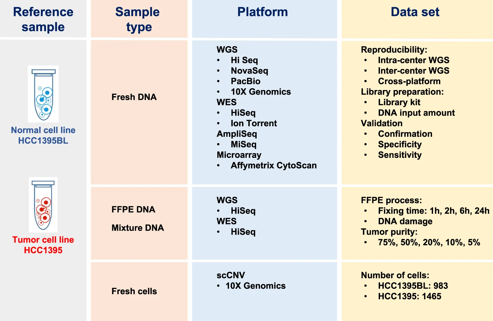

# Analysis SEQC2 FFPE

Here, matched FFPE and Fresh Frozen (FF) samples from the Sequencing Quality Control 2 (SEQC2) datasets are used to benchmark the performance of various FFPE artifact filtering tools against our in-house orientation-bias based statistical model - MOBSNVF.

## Dependencies

- python
- R
- SOBDetector (included)
- htspan ([djhshih/htspan](https://github.com/djhshih/htspan))
- samtools
- bcftools
- cromwell
- GATK
- gsutil
- rgsam ([djhshih/rgsam](https://github.com/djhshih/rgsam))
- dlazy ([djhshih/dlazy](https://github.com/djhshih/dlazy/tree/main))
- openjdk

### R packages
- tidyverse
- io
- precrec
- jsonlite
- argparser
- glue
- patchwork
- grid
- hrbrthemes
- viridis
- MicroSEC ([MANO-B/MicroSEC](https://github.com/MANO-B/MicroSEC))
- Rsamtools
- BiocGenerics
- Biostrings
- doParallel

### Python Libraries
- polars
- pysam
- pandas
- numpy
- matplotlib
- seaborn


## Study

The datasets used in our analysis are from the following publication:

[Whole genome and exome sequencing reference datasets from a multi-center and cross-platform benchmark study](https://www.nature.com/articles/s41597-021-01077-5)

The study generated a comprehensive set of WGS and WES data using two well-characterized reference samples (paired tumor-normal): a human breast cancer cell line (HCC1395) and a B lymphocytes cell line (HCC1395BL) derived from the same donor.

WGS and WES data were generated using various NGS library preparation protocols, seven NGS platforms (NovaSeq, HiSeq, PacBio, 10X Genomics, Ion Torrent, Miseq, and Affymetrix CytoScan HD) at six centers including Illumina (IL), National Cancer Institute (NC), Novartis (NV), European Infrastructure for Translational Medicine (EA), Fudan University (FD), and Loma Linda University (LL).

DNA was extracted from fresh cells or cell pellets mimicking the formalin-fixed paraffin-embedded (FFPE) process with fixation time of 1, 2, 6, or 24 hours. A small amount of DNA from fresh cells of HCC1395 and HCC1395BL was pooled at various ratios (3:1, 1:1, 1:4, 1:9 and 1:19) to create mixtures. Both fresh DNA and FFPE DNA were profiled on NGS or microarray platforms following manufacturer recommended protocols. To assess the reproducibility of WGS and WES, six sequencing centers performed a total of 12 replicates (3 × 3 + 3) on each platform. In addition, 12 WGS libraries constructed using three different library preparation protocols (TruSeq PCR-free, TruSeq-Nano, and Nextera Flex) in four different quantities of DNA inputs (1, 10, 100, and 250 ng) were sequenced on an Illumina HiSeq 4000, and nine WGS libraries constructed using the TruSeq PCR-free protocol were sequenced on an Illumina NovaSeq. Finally, Affymetrix Cytoscan HD and single-cell sequencing with 10X Genomics platform were performed to uncover the cytogenetics and heterogeneity of two cell lines.



## Datasets

The study has a dedicated webpage at: https://sites.google.com/view/seqc2/home/
Additionally, the data is deposited at: https://ftp-trace.ncbi.nlm.nih.gov/ReferenceSamples/seqc/Somatic_Mutation_WG/

- **WGS:** Whole Genome Sequencing (WGS) data sets for fresh DNA extracted from HCC1395BL and HCC1395 cell lines

- **WES:** Whole Exome Sequencing (WES) data sets for fresh DNA extracted from HCC1395BL and HCC1395 cell lines

- **FFG:** Whole Genome Sequencing (WGS) data sets for Formalin-Fixed Paraffin-Embedded (FFPE) process with fixation time of 1, 2, 6, or 24 hours for DNA extracted from HCC1395BL and HCC1395 cell lines

- **FFX:** Whole Exome Sequencing (WES) data sets for DNA extracted from HCC1395BL and HCC1395 cell lines and processed via Formalin-Fixed Paraffin-Embedded (FFPE) process with fixation time of 1, 2, 6, or 24 hours

- **LBP:** WGS Libraries were made from different library protocols such as TruSeq Nano, TruSeq PCR Free and Nextera Flex library protocol with different input amount and sequenced on Illumina HiSeq 3000/4000

- **SPP:** WGS Libraries were made from pooling the HCC1395 and HCC1395BL cell lines with various ratios (3:1, 1:1, 1:4, 1:9 and 1:19) to create mixtures

- **AMS:** AmpliSeq libraries were prepared using Illumina protocol and sequenced on MiSeq platform.

## Accession

- **SRA:** [SRP162370](https://www.ncbi.nlm.nih.gov/sra/?term=SRP162370)
- **ENA:** [SRP162370](https://www.ebi.ac.uk/ena/browser/view/SRP162370)
- **NCBI FTP:** https://ftp-trace.ncbi.nlm.nih.gov/ReferenceSamples/seqc/Somatic_Mutation_WG


## Cell lines

Cell lines HCC1395 (tumour) and HCC1395BL (blood) were derived from the same patient
with stage 1 breast ductal carcinoma.

HCC1395
https://www.atcc.org/products/crl-2324

HCC1395BL
https://www.atcc.org/products/crl-2325


## Replication

1. Clone this repository
   ```bash
   git clone --recurse-submodules https://github.com/djhshih/analysis-seqc2-ffpe.git
   ```

2. Install all the dependencies listed above

3. Navigate to the `annot` directory and run `annot.py`
    ```bash
    python annot.py
    ```
    This will generate annotation files describing all the samples which will be used later during preprocessing and analysis.

4. Navigate to the `data` directory and run the following commands:
    ```bash
    bash get_seqc2_common.sh
    bash get_gatk_data.sh
    ```

5. Navigate to the `data/bam` directory and run `get.sh`
    ```bash
    bash get.sh
    ```
    This will download all the SEQC2 BAM files to be used in the analysis.

6. Navigate to the `vcf/seqc2_repo/` directory and run `get.sh`
    ```bash
    bash get.sh
    ```
    This will download all the SEQC2 VCF files which were present in the repository.
    **Note:** VCF for only a handful of samples were present SEQC2 FTP repository.
    This is why we will be variant calling to generate our own VCF files from their respective BAMs later on.

7. Navigate to the `vcf/bam_variant_mutect2` directory and run:
    ```bash
    python prepare.py
    bash call_variants_mutect2.sh
    python link.py
    ```
    This will perform variant calling using GATK Mutect2 on all the BAM files downloaded in step 5.
    Resulting VCF files will be stored in `vcf/mutect2` directory.

8. Navigate to the `ffpe_snvf/ffpe_artifact_filtering` directory and run:
    ```bash
    python create_scripts.py
    bash ffpe-snvf.sh
    python make-microsec-imputs.py
    bash ffpe-snvf_microsec.sh
    ```
    This will run MOBSNVF, VAFSNVF, SOBDetector and MicroSEC on all the VCF files generated in step 7.
    Resulting filtered VCF files will be stored in `vcf/mobsnvf` directory.


## To Do 

- Rename directories:
    - data/ref -> data/gatk-reference-genome (Done)
    - data/reference_genome -> data/seqc2-reference-genome (Done)

- Update these changes in the variant calling scripts when that finishes: vcf/bam_variant_mutect2/prepare.py (Done)

- Figure out why Variant Calling Fails for some samples:

    - It was observed that some BAMs do not have sample names in their read groups. Therefore, the sample name cannot be extracted from the BAM files, as is done in WDL workflow.

## Issues

- BAMs from the FFG dataset do not have read groups. This causes failure during variant calling with GATK Mutect2.
- This issue was resolved by adding read groups to the BAM files using `samtools addreplacerg` command.

- The the exome target regions BED file provided in the FTP have contigs that are not present in the reference genome also provided in the FTP.
- This issue was partially resolved by using the WGS calling regions instead. However, some variant calling still fails. It seems mutect2 gets stuck on particular regions.

- WES VCFs from the FTP are messed up. They cannot be parsed using bcftools.
- Custom fixes need to be applied to these VCFs to make them parsable.

- VCFs under FFX datasets are still WES as evident by VCF header and file name.