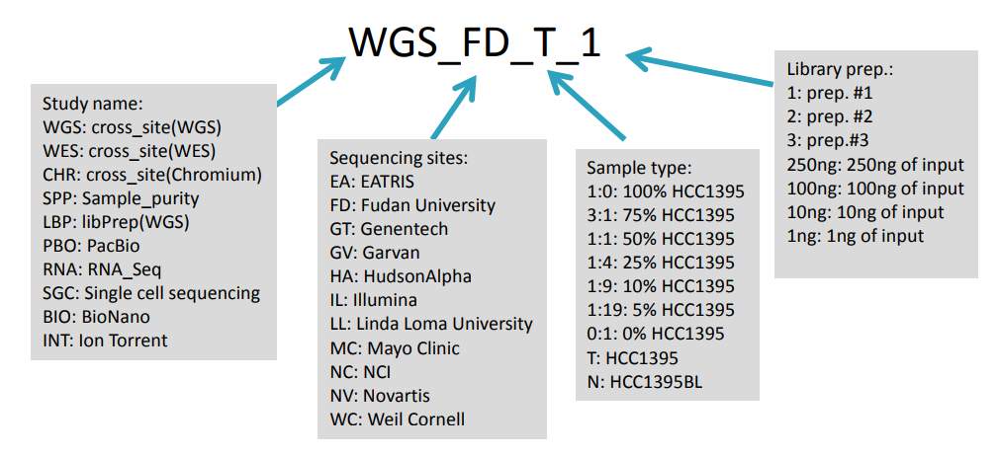

# Analysis SEQC2 FFPE

Here, matched FFPE and Fresh Frozen (FF) samples from the Sequencing Quality Control 2 (SEQC2) datasets are used to benchmark the performance of various FFPE artifact filtering tools against our in-house orientation-bias based statistical model - MOBSNVF.

## Dependencies

- python
- R
- SOBDetector (included)
- htspan ([djhshih/htspan](https://github.com/djhshih/htspan))
- samtools
- bcftools
- cromwell
- GATK
- gsutil
- rgsam ([djhshih/rgsam](https://github.com/djhshih/rgsam))
- dlazy ([djhshih/dlazy](https://github.com/djhshih/dlazy/tree/main))
- openjdk

### R packages
- tidyverse
- io
- precrec
- jsonlite
- argparser
- glue
- patchwork
- grid
- hrbrthemes
- viridis
- MicroSEC ([MANO-B/MicroSEC](https://github.com/MANO-B/MicroSEC))
- stringr
- remotes
- BiocManager
    - Rsamtools
    - BiocGenerics
    - Biostrings
    - GenomicAlignments
    - GenomeInfoDb
    - BSgenome.Hsapiens.UCSC.hg38


### Python Libraries
- polars
- pysam
- pandas
- numpy
- matplotlib
- seaborn


## Study

The datasets used in our analysis are from the following publication:

[Whole genome and exome sequencing reference datasets from a multi-center and cross-platform benchmark study](https://www.nature.com/articles/s41597-021-01077-5)

The study generated a comprehensive set of WGS and WES data using two well-characterized reference samples (paired tumor-normal): a human breast cancer cell line (HCC1395) and a B lymphocytes cell line (HCC1395BL) derived from the same donor.

WGS and WES data were generated using various NGS library preparation protocols, seven NGS platforms (NovaSeq, HiSeq, PacBio, 10X Genomics, Ion Torrent, Miseq, and Affymetrix CytoScan HD) at six centers including Illumina (IL), National Cancer Institute (NC), Novartis (NV), European Infrastructure for Translational Medicine (EA), Fudan University (FD), and Loma Linda University (LL).

DNA was extracted from fresh cells or cell pellets mimicking the formalin-fixed paraffin-embedded (FFPE) process with fixation time of 1, 2, 6, or 24 hours. A small amount of DNA from fresh cells of HCC1395 and HCC1395BL was pooled at various ratios (3:1, 1:1, 1:4, 1:9 and 1:19) to create mixtures. Both fresh DNA and FFPE DNA were profiled on NGS or microarray platforms following manufacturer recommended protocols. To assess the reproducibility of WGS and WES, six sequencing centers performed a total of 12 replicates (3 × 3 + 3) on each platform. In addition, 12 WGS libraries constructed using three different library preparation protocols (TruSeq PCR-free, TruSeq-Nano, and Nextera Flex) in four different quantities of DNA inputs (1, 10, 100, and 250 ng) were sequenced on an Illumina HiSeq 4000, and nine WGS libraries constructed using the TruSeq PCR-free protocol were sequenced on an Illumina NovaSeq. Finally, Affymetrix Cytoscan HD and single-cell sequencing with 10X Genomics platform were performed to uncover the cytogenetics and heterogeneity of two cell lines.


## Datasets

The study has a dedicated webpage at: https://sites.google.com/view/seqc2/home/
Additionally, the data is deposited at: https://ftp-trace.ncbi.nlm.nih.gov/ReferenceSamples/seqc/Somatic_Mutation_WG/

Only the **WGS**, **WES**, **FFG** and **FFX** datasets are relevant to our project. Detailed description is given below:

- **WGS:** Whole Genome Sequencing (WGS) data sets for fresh DNA extracted from HCC1395BL and HCC1395 cell lines
    - **Preservation Method:** Fresh DNA
    - **Cell Lines:** HCC1395BL (Normal), HCC1395 (Tumor)
    - **Sample Size:** 42 (21 Tumor, 21 Normal)
    - **Sequencing Centers:** 7 (EA, FD, IL, LL, NC, NS, NV)
    - **Sequencing method:** Whole Genome
    - **Source Data Types:** 
        - FASTQ (via ENA or SRA)
        - BAM (via NCBI FTP)
        - VCF (via NCBI FTP) - For all tumor samples, each with 3 alignment software (BWA, Bowtie, Novoalign) and 3 Variant Callers (Mutect2, Strelka, SomaticSniper)

- **WES:** Whole Exome Sequencing (WES) data sets for fresh DNA extracted from HCC1395BL and HCC1395 cell lines
    - **Preservation Method:** Fresh DNA
    - **Cell Lines:** HCC1395BL (Normal), HCC1395 (Tumor)
    - **Sample Size:** 24 (12 Tumor, 12 Normal) 
    - **Sequencing Centers:** 6 (EA, FD, IL, LL, NC, NV)
    - **Sequencing method:** Whole Exome
    - **Source Data Types:** 
        - FASTQ (via ENA or SRA)
        - BAM (via NCBI FTP)
        - VCF (via NCBI FTP) - For all tumor samples, each with 3 alignment software (BWA, Bowtie, Novoalign) and 3 Variant Callers (Mutect2, Strelka, SomaticSniper)


- **FFG:** Whole Genome Sequencing (WGS) data sets for Formalin-Fixed Paraffin-Embedded (FFPE) process with fixation time of 1, 2, 6, or 24 hours for DNA extracted from HCC1395BL and HCC1395 cell lines
    - **Preservation Method:** FFPE
    - **Cell Lines:** HCC1395BL (Normal), HCC1395 (Tumor)
    - **Sample Size:** 24 (12 Tumor, 12 Normal) 
    - **Sequencing Centers:** 2 (GZ, IL)
    - **Sequencing method:** Whole Genome
    - **Source Data Types:** 13 Tumor, 13 Normal
        - FASTQ (via ENA or SRA)
        - BAM (via NCBI FTP)
        - VCF (via NCBI FTP) - For only for 3 samples, each with 3 alignment software (BWA, Bowtie, Novoalign) and 3 Variant Callers (Mutect2, Strelka, SomaticSniper).

- **FFX:** Whole Exome Sequencing (WES) data sets for DNA extracted from HCC1395BL and HCC1395 cell lines and processed via Formalin-Fixed Paraffin-Embedded (FFPE) process with fixation time of 1, 2, 6, or 24 hours
    - **Preservation Method:** FFPE
    - **Cell Lines:** HCC1395BL (Normal), HCC1395 (Tumor)
    - **Sequencing Centers:** 2 (GZ, IL)
    - **Sequencing method:** Whole Exome
    - **Source Data Types:** 
        - FASTQ (via ENA or SRA)
        - BAM (via NCBI FTP)
        - VCF (via NCBI FTP) - For only 1 sample, each with 3 alignment software (BWA, Bowtie, Novoalign) and 3 Variant Callers (Mutect2, Strelka, SomaticSniper)

- **LBP:** WGS Libraries were made from different library protocols such as TruSeq Nano, TruSeq PCR Free and Nextera Flex library protocol with different input amount and sequenced on Illumina HiSeq 3000/4000
    - **Preservation Method:** Fresh DNA
    - **Cell Lines:** HCC1395BL (Normal), HCC1395 (Tumor)
    - **Sample Size:** 14 (7 Tumor, 7 Normal)
    - **Sequencing Centers:** 2 (IL, LL)
    - **Sequencing method:** Whole Genome
    - **Source Data Types:** 
        - FASTQ (via ENA or SRA)
        - BAM (via NCBI FTP)
        - VCF (via NCBI FTP) - For only 7 samples, each with 3 alignment software (BWA, Bowtie, Novoalign) and 3 Variant Callers (Mutect2, Strelka, SomaticSniper)

- **SPP:** WGS Libraries were made from pooling the HCC1395 and HCC1395BL cell lines with various ratios (3:1, 1:1, 1:4, 1:9 and 1:19) to create mixtures
    - **Preservation Method:** Fresh DNA
    - **Cell Lines:** HCC1395BL (Normal), HCC1395 (Tumor)
    - **Sample Size:** 21 (Tumor DNA pooled with Normal)
    - **Sequencing Centers:** 1 (GT)
    - **Sequencing method:** Whole Genome
    - **Source Data Types:** 
        - FASTQ (via ENA or SRA)
        - VCF (via NCBI FTP)

- **AMS:** AmpliSeq libraries were prepared using Illumina protocol and sequenced on MiSeq platform.
    - **Preservation Method:** Fresh DNA
    - **Cell Lines:** HCC1395BL (Normal), HCC1395 (Tumor)
    - **Sample Size:** 21 (Tumor DNA pooled with Normal)
    - **Sequencing Centers:** 1 (GT)
    - **Sequencing method:** Whole Genome
    - **Source Data Types:** 
        - FASTQ (via ENA or SRA)
        - BAM (via NCBI FTP)
        - VCF (via NCBI FTP)

### Naming Convention



## Accession

- **SRA:** [SRP162370](https://www.ncbi.nlm.nih.gov/sra/?term=SRP162370)
- **ENA:** [SRP162370](https://www.ebi.ac.uk/ena/browser/view/SRP162370)
- **NCBI FTP:** https://ftp-trace.ncbi.nlm.nih.gov/ReferenceSamples/seqc/Somatic_Mutation_WG


## Cell lines

Cell lines HCC1395 (tumour) and HCC1395BL (blood) were derived from the same patient
with stage 1 breast ductal carcinoma.

HCC1395
https://www.atcc.org/products/crl-2324

HCC1395BL
https://www.atcc.org/products/crl-2325


## Replication

1. Clone this repository
   ```bash
   git clone --recurse-submodules https://github.com/djhshih/analysis-seqc2-ffpe.git
   ```

2. Install all the dependencies listed above

3. Navigate to the `annot` directory and run `annot.py`
    ```bash
    python annot.py
    ```
    This will generate annotation files describing all the samples which will be used later during preprocessing and analysis.

4. Navigate to the `data` directory and run the following commands:
    ```bash
    bash get_seqc2_common.sh
    bash get_gatk_data.sh
    ```

5. Navigate to the `data/bam` directory and run `get.sh`
    ```bash
    bash get.sh
    bash fix.sh
    ```
    This will download all the SEQC2 BAM files to be used in the analysis. 
    Then fix the file name for the Amplicon dataset and add RG to the BAMs in the FFG dataset

6. Navigate to the `vcf/seqc2_repo/` directory and run `get.sh`
    ```bash
    bash get.sh
    ```
    This will download all the SEQC2 VCF files which were present in the repository.
    **Note:** VCF for only a few FFPE samples were present SEQC2 FTP repository.
    This is why we perform our own variant calling to generate our own VCF files from their respective BAMs.

7. Navigate to the `vcf/bam_variant_mutect2` directory and run:
    ```bash
    python prepare.py
    bash call_variants_mutect2.sh
    python link.py
    ```
    This will perform variant calling using GATK Mutect2 on all the BAM files downloaded in step 5.
    Resulting VCF files will be stored in `vcf/mutect2-matched-normal_filtermutectcalls_obmm_unfiltered` directory.
    These are VCFs after the FilterMutectCalls stage and contains variants which are flagged with multiple filter annotations

8. Navigate to the `vcf/mutect2-matched-normal_pass-orientation-filtered` directory and run:
    ```bash
    bash filter_vcf.sh
    ```
    This will filter the VCFs to only retain the vatiants with either a "PASS" or "orientation" annotation in the filter column.
    We keep the orientation annotated variants to evaluate the performance of GATK's Orientation Bias Mixture Model later on against other FFPE artifact filtering models.

8. Navigate to the `ffpe_snvf/ffpe_artifact_filtering` directory and run:
    ```bash
    python create_scripts.py
    bash ffpe-snvf.sh
    python make-microsec-imputs.py
    bash ffpe-snvf_microsec.sh
    ```
    This will run MOBSNVF, VAFSNVF, SOBDetector and MicroSEC on all the VCF files generated in step 7.
    

9. Navigate to the `eval` directory and run:

    ```bash
    bash run.sh
    ```

    This will create evaluation results in the following directory `eval/mutect2-matched-normal_pass-orientation-filtered/<dataset_id>` under the following subdirectories:
    - `model-scores_truth/`: This contains the SNV table of each sample along with the ground truth annotation and score from each ffpe filter.
    - `plots/roc_prc_plots`: This contains the per sample ROC and PRC plots as well as the overall evaluation plot across all samples. Individual ROC and PRC plots can be found in the `ROC` and `PRC` directories respectively.
    - `roc-prc-auc/precrec`: This contains the AUC tables and the ROC and PRC coordinates for each samples with each FFPE filter as well as the overall evaluation results of every samples and filters. The `combined_auc_table.tsv` contains all the AUROC and AUPRC of each sample and ffpe filter. 


## Preprocessing

### Variant Calling

Variant calling is performed using GATK Mutect2 on all the BAM files downloaded from SEQC2 FTP repository in matched tumor-normal mode. For normal BAM, one from a fresh DNA sample with the largest file size was chosen within the same sequencing method. This is illustrated below for each dataset:

| Dataset of Tumor (HCC1395) Samples | Dataset of Fresh Normal (HCC1395BL) Samples | Normal BAM chosen |
|-------------------|----------------------------------|------------------|
| FFX | WES | WES_IL_N_2.bwa.dedup.bam |
| FFG | WGS | WGS_IL_N_1.bwa.dedup.bam |
| WES | WES | WES_IL_N_2.bwa.dedup.bam |
| WGS | WGS | WGS_IL_N_1.bwa.dedup.bam |
| LBP | WGS | WGS_IL_N_1.bwa.dedup.bam |
| AMS | AMS | AMS_AB_N_1.bwa.bam |


### Resolved Issues

- BAMs from the FFG dataset did not have read groups. This caused failure during variant calling with GATK Mutect2. To resolve this, read groups were added to the BAM files using `samtools addreplacerg` command. The following read group template was used matching the read group style of other BAM files from SEQC2 repository:

    `@RG    ID:<sample_name>    LB:na PL:ILLUMINA   SM:<sample_name>    PU:na CN:na DS:<bam_file_name>`


- The Exome target regions BED file provided in the FTP had contigs that were not present in the reference genome also provided in the FTP. This caused failure during variant calling with GATK Mutect2 for some samples in the Whole Exome Sequencing datasets - WES and FFX.  To resolve this, the WGS calling regions BED file provided by the Broad Institute in their reference genome bundle for hg38 was used instead:

    `gs://genomics-public-data/resources/broad/hg38/v0/wgs_calling_regions.hg38.interval_list`


- Lastly, some variant calling on some samples still failed due to system and resource related issues. One example was that mutect2 got stuck on particular regions in the Amplicon and WGS datasets. The WDL scripts are made to allocate 3.5 GB of memory for each shard (a genomic interval that is processed by a single instance of Mutect2, as variant calling is performed by splitting the BAM into smaller chunks to speed up analysis). As Amplicon data has very high coverage in small regions and WGS data has very large regions, it was deduced that 3.5 GB of memory was not sufficient. Therefore, the WDL scripts were modified to allocate more memory per shard. This resolved the issue.

## FFPE Artifact Filtering

So far, the following filters were tested:

- MOBSNVF (Our orientation bias based statistical model)
- VAFSNVF (Our Variant Allele Frequency based filter)
- SOBDetector
- MicroSEC
- GATK Orientation Bias Mixture Model (can only be used when variant calling using Mutect2)

Pending:

- CisCall's CisMuton module (only works where samples have matched normal)
- IDEAFIX (Installation Issues)
- FFPolish (Execution Issues)
- FIREVAT (Execution Issues)

Skipped:
- DeepOMICS FFPE (Source code is not available. In-House implementaiton request was denied)

## Observations

- When preparing inputs for MicroSEC it was observed that the dataset FFX (FFPE WES) has the modal read length of 151 from the GZ sequencing center and 125 from the IL sequencing center. The read lengths for FFG (FFPE WGS) had a modal read length of 125 across both IL and GZ sequencing centers.

## Limitations

- It would be better if we could test out multiple variant callers and multiple alignment tools as made available for some samples in the repository.

## To Do

- Rename directories:
    - data/ref -> data/gatk-reference-genome (Done)
    - data/reference_genome -> data/seqc2-reference-genome (Done)

- Update these changes in the variant calling scripts when that finishes: vcf/bam_variant_mutect2/prepare.py (Done)

- Figure out why Variant Calling Fails for some samples (Done)

- Check the md5sum for all the bams

- Fix the issues with the VCFs provided by the FTP. Perhaps make a  sorted variant table and feed it to the filters.

- Perhaps make another set of variant calls using all the matched normals from the same sequencing center

### Ongoing

- Redownloading all the FFG samples again.
- Add RG to these BAMs as they lack RG
- Recall the variants

## Issues

- BAMs from the FFG dataset do not have read groups. This causes failure during variant calling with GATK Mutect2.
    - This issue was resolved by adding read groups to the BAM files using `samtools addreplacerg` command.

- The the exome target regions BED file provided in the FTP have contigs that are not present in the reference genome also provided in the FTP.
    - This issue was partially resolved by using the WGS calling regions instead. However, some variant calling still fails. It seems mutect2 gets stuck on particular regions.

- Some BAMs did not have the MD5 checksum as the it was supposed to have. These are being redownloaded 

- WES VCFs from the FTP are messed up. They cannot be parsed using bcftools.
    - Custom fixes need to be applied to these VCFs to make them parsable.
    - For now, FFPE filtering using these VCFs are skipped in favor of the VCFs called by these BAMs

- VCFs under FFX datasets are from WES dataset as evident by VCF header and file name.
